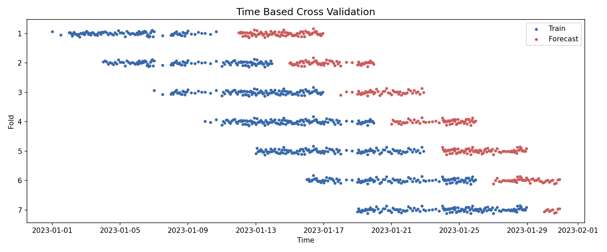

[](https://github.com/astral-sh/ruff)


# Time based cross validation

**timebasedcv** is a Python codebase that provides a cross validation strategy based on time.

---

[Documentation](https://fbruzzesi.github.io/timebasedcv) | [Repository](https://github.com/fbruzzesi/timebasedcv) | [Issue Tracker](https://github.com/fbruzzesi/timebasedcv/issues)

---

## Disclaimer ⚠️

This codebase is experimental and is working for my use cases. It is very probable that there are cases not entirely covered and for which it could break (badly). If you find them, please feel free to open an issue in the [issue page](https://github.com/FBruzzesi/timebasedcv/issues/new){:target="_blank"} of the repo.

## Description ✨

The current implementation of [scikit-learn TimeSeriesSplit](https://scikit-learn.org/stable/modules/generated/sklearn.model_selection.TimeSeriesSplit.html){:target="_blank"} lacks the flexibility of having multiple samples within the same time period (or time unit).

**timebasedcv** addresses such problem by providing a cross validation strategy based on a **time period** rather than the number of samples. This is useful when the data is time dependent, and the split should keep together samples within the same time window.

Temporal data leakage is an issue and we want to prevent it from happening by providing splits that make sure the past and the future are well separated, so that data leakage does not spoil in a model cross validation.

Again, these splits points solely depend on the time period and not the number of observations.

### Features 📜

We introduce two main classes:

- [`TimeBasedSplit`](https://fbruzzesi.github.io/timebasedcv/api/timebasedcv/#timebasedcv.core.TimeBasedSplit) allows to define a split based on time unit (frequency), train size, test size, gap, stride, window type and mode. Remark that `TimeBasedSplit` is **not** compatible with [scikit-learn CV Splitters](https://scikit-learn.org/stable/common_pitfalls.html#id3). In fact, we have made the (opinioned) choice to:

  - Return the sliced arrays from `.split(...)`, while scikit-learn CV Splitters return train and test indices of the split.
  - Require to pass the time series as input to `.split(...)` method, while scikit-learn CV Splitters require to provide only `X, y, groups` to `.split(...)`.
  - Such time series is used to generate the boolean masks with which we slice the original arrays into train and test for each split.

- Considering the above choices, we also provide a scikit-learn compatible splitter: [`TimeBasedCVSplitter`](https://fbruzzesi.github.io/timebasedcv/api/sklearn/#timebasedcv.sklearn.TimeBasedCVSplitter). Considering the signature that `.split(...)` requires and the fact that CV Splitters need to know a priori the number of splits, `TimeBasedCVSplitter` is initialized with the time series containing the time information used to generate the train and test indices of each split.

## Installation 💻

TL;DR:

```bash
python -m pip install timebasedcv
```

For further information, please refer to the dedicated [installation](https://fbruzzesi.github.io/timebasedcv/installation) section.

## Quickstart 🏃

The following code snippet is all you need to get started, yet consider checking out the [getting started](https://fbruzzesi.github.io/timebasedcv/user-guide/getting-started/) section of the documentation for a detailed guide on how to use the library.

The main takeaway should be that `TimeBasedSplit` allows for a lot of flexibility at the cost of having to specify a long list of parameters. This is what makes the library so powerful and flexible to cover the large majority of use cases.

First let's generate some data with different number of points per day:

```python
import numpy as np
import pandas as pd

RNG = np.random.default_rng(seed=42)

dates = pd.Series(pd.date_range("2023-01-01", "2023-01-31", freq="D"))
size = len(dates)

df = (pd.concat([
        pd.DataFrame({
            "time": pd.date_range(start, end, periods=_size, inclusive="left"),
            "a": RNG.normal(size=_size-1),
            "b": RNG.normal(size=_size-1),
        })
        for start, end, _size in zip(dates[:-1], dates[1:], RNG.integers(2, 24, size-1))
    ])
    .reset_index(drop=True)
    .assign(y=lambda t: t[["a", "b"]].sum(axis=1) + RNG.normal(size=t.shape[0])/25)
)

df.set_index("time").resample("D").agg(count=("y", np.size)).head(5)
```

```terminal
            count
time
2023-01-01      2
2023-01-02     18
2023-01-03     15
2023-01-04     10
2023-01-05     10
```

Then lets instantiate the `TimeBasedSplit` class:

```python
from timebasedcv import TimeBasedSplit

tbs = TimeBasedSplit(
    frequency="days",
    train_size=10,
    forecast_horizon=5,
    gap=1,
    stride=3,
    window="rolling",
    mode="forward",
)
```

Now let's run split the data with the provided `TimeBasedSplit` instance:

```py title="Generate the splits"
X, y, time_series = df.loc[:, ["a", "b"]], df["y"], df["time"]

for X_train, X_forecast, y_train, y_forecast in tbs.split(X, y, time_series=time_series):
    print(f"Train: {X_train.shape}, Forecast: {X_forecast.shape}")
```

```terminal
Train: (100, 2), Forecast: (51, 2)
Train: (114, 2), Forecast: (50, 2)
...
Train: (124, 2), Forecast: (40, 2)
Train: (137, 2), Forecast: (22, 2)
```

As we can see, each split does not necessarely have the same number of points, this is because the time series has a different number of points per day.

A picture is worth a thousand words, let's visualize the splits (blue dots represent the train points, while the red dots represent the forecastng points):



## Contributing ✌️

Please read the [Contributing guidelines](https://fbruzzesi.github.io/timebasedcv/contribute/) in the documentation site.

## License 👀

The project has a [MIT Licence](https://github.com/FBruzzesi/timebasedcv/blob/main/LICENSE)
