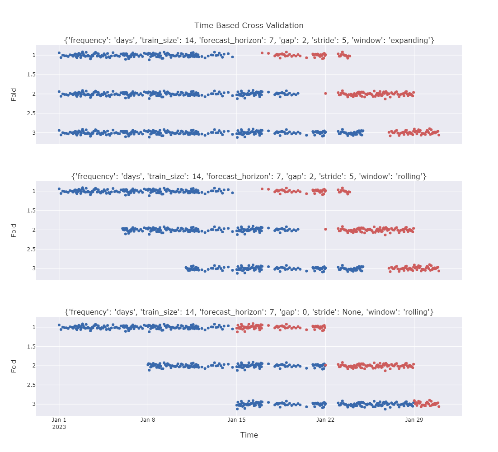

# Getting Started

The following sections will guide you through the basic usage of the library.

## TimeBasedSplit

The [`TimeBasedSplit`](../api/timebasedsplit/#timebasedcv.timebasedsplit.TimeBasedSplit) class allows to define a time based split with a given frequency, train size, test size, gap, stride and window type.

```python
from timebasedcv import TimeBasedSplit

tbs = TimeBasedSplit(
    frequency="days",
    train_size=30,
    forecast_horizon=7,
    gap=0,
    stride=3,
    window="rolling",
)
```

The available values for the parameters are:

- `frequency`: "days", "seconds", "microseconds", "milliseconds", "minutes", "hours", "weeks".
- `train_size`: any strictly positive integer.
- `forecast_horizon`: any strictly positive integer.
- `gap`: any non-negative integer.
- `stride`: any strictly positive integer or `None`.
- `window`: "rolling" or "expanding".

Once the instance is created, it is possible to split the data using the `split` method. This method requires to pass a `time_series` as input to create the boolean masks for train and test.

Optionally it is possible to pass a `start_dt` and `end_dt` arguments as well. If provided, they are used in place of the `time_series.min()` and `time_series.max()` respectively to determine the period.

This is useful because the series does not necessarely starts from the first date and/or terminates in the last date of the time period of interest.

```python
import pandas as pd
import numpy as np

time_series = pd.Series(pd.date_range("2023-01-01", "2023-12-31", freq="D"))
size = len(time_series)

df = (pd.DataFrame(data=np.random.randn(size, 2), columns=["a", "b"])
    .assign(y=lambda t : t[["a", "b"]].sum(axis=1))
)

X, y = df[["a", "b"]], df["y"]

print(f"Number of splits: {tbs.n_splits_of(time_series=time_series)}")
#  Number of splits: 112

for X_train, X_forecast, y_train, y_forecast in tbs.split(X, y, time_series=time_series):
    print(f"Train: {X_train.shape}, Forecast: {X_forecast.shape}")

# Train: (30, 2), Forecast: (7, 2)
# Train: (30, 2), Forecast: (7, 2)
# ...
# Train: (30, 2), Forecast: (7, 2)
```

Another optional parameter that can be passed to the `split` method is `return_splitstate`. If `True`, the method will return a [`SplitState`](api/splitstate/) dataclass which contains the "split" points for training and test, namely `train_start`, `train_end`, `forecast_start` and `forecast_end`. These can be useful if a particular logic needs to be applied to the data before training and/or forecasting.

## TimeBasedCVSplitter

The [`TimeBasedCVSplitter`](../api/timebasedsplit/#timebasedcv.timebasedsplit.TimeBasedCVSplitter) class conforms with scikit-learn CV Splitters. In order to achieve such behaviour we combine the arguments of [`TimeBasedSplit`](../api/timebasedsplit/#timebasedcv.timebasedsplit.TimeBasedSplit) `__init__` and `split` methods, so that it is possible to restrict the arguments of
`split` and `get_n_splits` to the arrays to split (i.e. `X`, `y` and `groups`), which are the only arguments required by scikit-learn CV Splitters.

That is because a CV Splitter needs to know a priori the number of splits and the `split` method shouldn't take any extra arguments as input other than the arrays to split.

```python
import pandas as pd
import numpy as np

from sklearn.linear_model import Ridge
from sklearn.model_selection import RandomizedSearchCV

from timebasedcv import TimeBasedCVSplitter

start_dt = pd.Timestamp(2023, 1, 1)
end_dt = pd.Timestamp(2023, 12, 31)

cv = TimeBasedCVSplitter(
    frequency="days",
    train_size=30,
    forecast_horizon=7,
    time_series=time_series,
    gap=0,
    stride=3,
    window="rolling",
    start_dt=start_dt,
    end_dt=end_dt,
)

param_grid = {
    "alpha": np.linspace(0.1, 2, 10),
    "fit_intercept": [True, False],
    "positive": [True, False],
}

random_search_cv = RandomizedSearchCV(
    estimator=Ridge(),
    param_distributions=param_grid,
    cv=cv,
    n_jobs=-1,
).fit(X, y)

random_search_cv.best_params_
# {'positive': True, 'fit_intercept': False, 'alpha': 0.1}
```

## Examples of Cross Validation

The following examples show how the CV works with different parameters.

First and foremost let's generate some random data. The following code generates a time series with randomly spaced points between 2023-01-01 and 2023-01-31.

```python
import pandas as pd
import numpy as np
np.random.seed(42)

dates = pd.Series(pd.date_range("2023-01-01", "2023-01-31", freq="D"))
size = len(dates)

df = pd.concat([
    pd.DataFrame({
        "time": pd.date_range(start, end, periods=_size, inclusive="left"),
        "value": np.random.randn(_size-1)/25,
    })
    for start, end, _size in zip(dates[:size], dates[1:], np.random.randint(2, 24, size-1))
]).reset_index(drop=True)

time_series, X = df["time"], df["value"]
df.set_index("time").resample("D").count().head(5)

# time	        value
# 2023-01-01	14
# 2023-01-02	2
# 2023-01-03	22
# 2023-01-04	11
# 2023-01-05	1
```

As we can see every day has a different number of points.

Now let's plot train and forecasting splits with different split strategies (or configurations).

The green dots represent the train points, while the red dots represent the forecastng points.



Here is the code to replicate the results:

```python
configs = [
    {
        "frequency": "days",
        "train_size": 14,
        "forecast_horizon": 7,
        "gap": 2,
        "stride": 5,
        "window": "expanding"
    },
    {
        "frequency": "days",
        "train_size": 14,
        "forecast_horizon": 7,
        "gap": 2,
        "stride": 5,
        "window": "rolling"
    },
    {
        "frequency": "days",
        "train_size": 14,
        "forecast_horizon": 7,
        "gap": 0,
        "stride": None,
        "window": "rolling"
    }
]

import plotly.graph_objects as go
from plotly.subplots import make_subplots

from timebasedcv import TimeBasedSplit

fig = make_subplots(
    rows=len(configs),
    cols=1,
    subplot_titles=[str(config) for config in configs],
    shared_xaxes=True,
    vertical_spacing=0.1,
    x_title="Time",
)

for _row, config in enumerate(configs, start=1):

    tbs = TimeBasedSplit(
        **config,
    )


    fmt = "%Y-%m-%d"
    for _fold, (train_forecast, split_state) in enumerate(tbs.split(X, time_series=time_series, return_splitstate=True), start=1):

        train, forecast = train_forecast

        ts = split_state.train_start.strftime(fmt)
        te = split_state.train_end.strftime(fmt)
        fs = split_state.forecast_start.strftime(fmt)
        fe = split_state.forecast_end.strftime(fmt)

        print(ts, te, fs, fe)
        fig.add_trace(
            go.Scatter(
                x=time_series[time_series.between(ts, te, inclusive="left")],
                y=train + _fold,
                name=f"Train Fold {_fold}",
                mode="markers",
                marker={
                    "color": "seagreen",
                }
            ),
            row=_row,
            col=1,
        )

        fig.add_trace(
            go.Scatter(
                x=time_series[time_series.between(fs, fe, inclusive="left")],
                y=forecast + _fold,
                name=f"Forecast Fold {_fold}",
                mode="markers",
                marker={
                    "color": "indianred",
                }
            ),
            row=_row,
            col=1,
        )

fig.update_layout(
    title={
        "text": "Time Based Cross Validation",
        "y":0.95, "x":0.5,
        "xanchor": "center",
        "yanchor": "top"
    },
    showlegend=False,
    height=1000,
    **{
        f"yaxis{i}": {"autorange": "reversed", "title": "Fold"}
        for i in range(1, len(configs)+1)
    }
)

fig.show()
```
