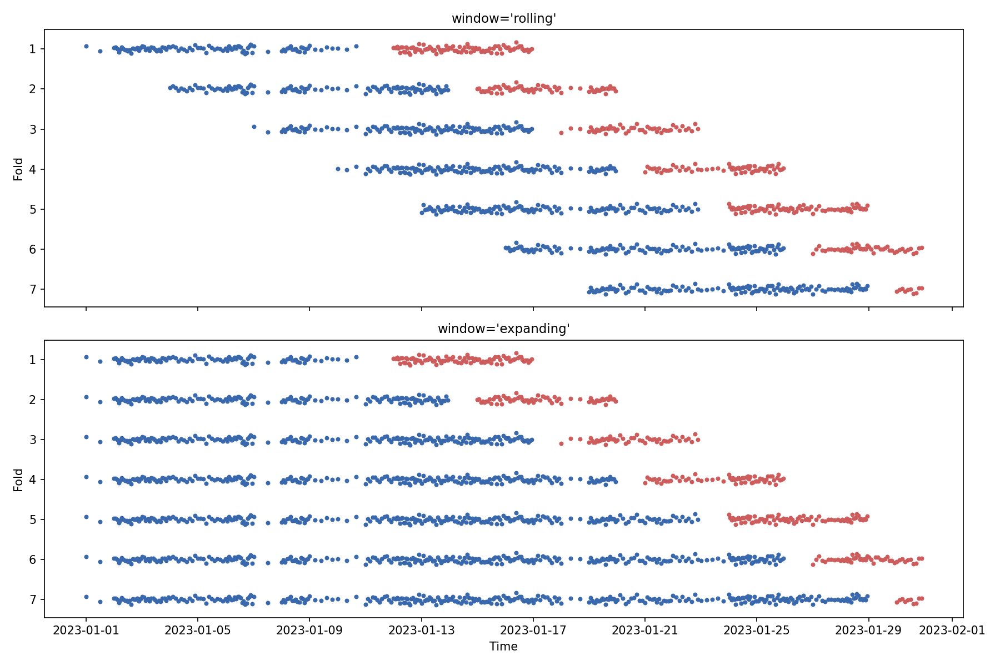
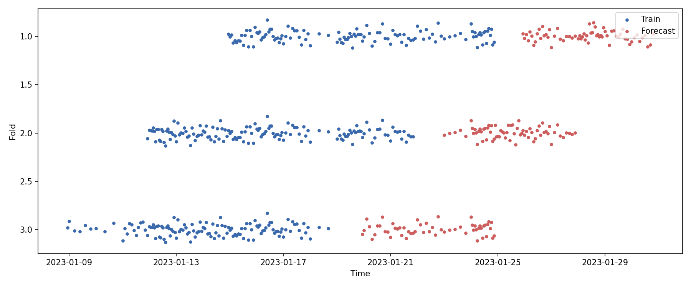

# Advanced features 🐍🐍

There are some a few more advanced features that can be used with the `TimeBasedSplit` class.

Let's first create a dataset to show how these features work.

??? example "Code to generate the data"

    ```python title="Generate the data"
    import numpy as np
    import pandas as pd

    RNG = np.random.default_rng(seed=42)

    dates = pd.Series(pd.date_range("2023-01-01", "2023-01-31", freq="D"))
    size = len(dates)

    df = (pd.concat([
            pd.DataFrame({
                "time": pd.date_range(start, end, periods=_size, inclusive="left"),
                "a": RNG.normal(size=_size-1),
                "b": RNG.normal(size=_size-1),
            })
            for start, end, _size in zip(dates[:-1], dates[1:], RNG.integers(2, 24, size-1))
        ])
        .reset_index(drop=True)
        .assign(y=lambda t: t[["a", "b"]].sum(axis=1) + RNG.normal(size=t.shape[0])/25)
    )

    X, y, time_series = df.loc[:, ["a", "b"]], df["y"], df["time"]

    df.set_index("time").resample("D").agg(count=("y", np.size)).head(5)
    ```

    ```terminal
                count
    time
    2023-01-01      2
    2023-01-02     18
    2023-01-03     15
    2023-01-04     10
    2023-01-05     10
    ```

## `SplitState` information

Internally we make use of a dataclass called [`SplitState`](../api/splitstate.md) to store the split points for training and forecasting. This dataclass can be accessed by passing the `return_splitstate` parameter to the `split` method.

```python
from timebasedcv import TimeBasedSplit

tbs = TimeBasedSplit(
    frequency="days",
    train_size=10,
    forecast_horizon=5,
    gap=1,
    stride=3,
)

for _, split_state in tbs.split(X, y, time_series=time_series, return_splitstate=True):
    print(split_state)
```

```terminal
SplitState(train_start=Timestamp('2023-01-01 00:00:00'), train_end=Timestamp('2023-01-11 00:00:00'), forecast_start=Timestamp('2023-01-12 00:00:00'), forecast_end=Timestamp('2023-01-17 00:00:00'))
SplitState(train_start=Timestamp('2023-01-04 00:00:00'), train_end=Timestamp('2023-01-14 00:00:00'), forecast_start=Timestamp('2023-01-15 00:00:00'), forecast_end=Timestamp('2023-01-20 00:00:00'))
...
SplitState(train_start=Timestamp('2023-01-16 00:00:00'), train_end=Timestamp('2023-01-26 00:00:00'), forecast_start=Timestamp('2023-01-27 00:00:00'), forecast_end=Timestamp('2023-02-01 00:00:00'))
SplitState(train_start=Timestamp('2023-01-19 00:00:00'), train_end=Timestamp('2023-01-29 00:00:00'), forecast_start=Timestamp('2023-01-30 00:00:00'), forecast_end=Timestamp('2023-02-04 00:00:00'))
```

This feature can be useful in those cases where a particular logic needs to be applied to the data before training and/or forecasting depending on the split point, or in general it yields more flexibility and control to the user.

For instance let's say that a model is retrained only on a new week:

```python
from sklearn import clone
from sklearn.dummy import DummyRegressor

model = DummyRegressor()
current_week = None

for (X_train, X_forecast, y_train, y_forecast), split_state in tbs.split(X, y, time_series=time_series, return_splitstate=True):

    split_week = split_state.train_start.strftime("%Y-W%W")
    if  (current_week is None) or (split_week > current_week):
        model = clone(model).fit(X_train, y_train)
        current_week = split_week
        print(f"\nTraining for week {split_week}")

    score = round(model.score(X_forecast, y_forecast), 3)
    print(f"{score=}")

```

```terminal
Training for week 2023-W00
score=-0.011

Training for week 2023-W01
score=-0.003
score=-0.002

Training for week 2023-W02
score=-0.022
score=-0.047

Training for week 2023-W03
score=-0.004
score=-0.403
```

## Multiple arrays of different types


## Window types

In time series forecasting we can use two different type of windows to split the data into training and testing while backtesting/cross-validating a model: _rolling_ or _expanding_.

A rolling window is a fixed-size window that slides over the data, while an expanding window starts with a minimum size and grows over time.

The `window` parameter can be set to either `"rolling"` (or default) or `"expanding"` to choose the window type to use when splitting the data.

Let's use the same dataset and configuration as before but with different window types.



As we can assess graphically, the _only_ difference is the size of the training set, for the rolling window it has a fixed size (in terms of time periods) while the expanding window grows in size over time. On the other hand, the forecasting set is the same for both window types.

Since working with different window types is quite common, we provide two classes that inherit from `TimeBasedSplit` and set the `window` parameter to `"rolling"` and `"expanding"` (respectively [`RollingTimeSplit`](../api/timebasedcv.md#timebasedcv.core.RollingTimeSplit) and [`ExpandingTimeSplit`](../api/timebasedcv.md#timebasedcv.core.ExpandingTimeSplit)).

??? example "Code to generate the plot"

    ```python
    import plotly.graph_objects as go
    from plotly.subplots import make_subplots

    base_config = {
        "frequency": "days",
        "train_size": 10,
        "forecast_horizon": 5,
        "gap": 1,
        "stride": 3
    }

    window_types = ["rolling", "expanding"]

    fig = make_subplots(
        rows=len(window_types),
        cols=1,
        subplot_titles=[f"window='{w}'" for w in window_types],
        shared_xaxes=True,
        vertical_spacing=0.1,
        x_title="Time",
    )

    for _row, window in enumerate(window_types, start=1):

        tbs = TimeBasedSplit(window=window, **base_config)

        for _fold, (train_forecast, split_state) in enumerate(tbs.split(y/25, time_series=time_series, return_splitstate=True), start=1):

            train, forecast = train_forecast

            ts, te = split_state.train_start, split_state.train_end
            fs, fe = split_state.forecast_start, split_state.forecast_end

            fig.add_trace(
                go.Scatter(
                    x=time_series[time_series.between(ts, te, inclusive="left")],
                    y=train + _fold,
                    name=f"Train Fold {_fold}",
                    mode="markers",
                    marker={"color": "rgb(57, 105, 172)"}
                ),
                row=_row,
                col=1,
            )

            fig.add_trace(
                go.Scatter(
                    x=time_series[time_series.between(fs, fe, inclusive="left")],
                    y=forecast + _fold,
                    name=f"Forecast Fold {_fold}",
                    mode="markers",
                    marker={"color": "indianred"}
                ),
                row=_row,
                col=1,
            )

    fig.update_layout(
        showlegend=False,
        height=1000,
        **{
            f"yaxis{i}": {"autorange": "reversed", "title": "Fold"}
            for i in range(1, len(window_types)+1)
        }
    )

    fig.show()
    ```

## Mode types

There could be cases in which you want to generate the splits starting from the most recent observations and moving backwards in time. This is where the `mode` parameter comes in handy.

The `mode` parameter can be set to either `"forward"` (our default) or `"backward"` to choose the direction in which the splits are moving.

Let's use the same dataset and configuration as before but with different mode types.


As we wanted, the folds are generated in the opposite direction, starting from the most recent observations and moving backwards in time. However that's not the only difference between the two split sets.

Since we want to guarantee that the train set is always at least of size `train_size`, the last few splits could end up with a smaller test set than the forecast horizon, in order to "see" every data point.

On the other hand, for the backward mode, we **also** guarantee that the forecast set is always of size `forecast_horizon`, however, in the `window="rolling"` case, this could mean that not every data point is seen (in the figure above, Jan 1st is never used in the training set).

Therefore we end up with a different number of total splits, and this would hold true even in the case of `window="expanding"` (in which however all the observation are used).

??? example "Code to generate the plot"

    ```python
    import plotly.graph_objects as go
    from plotly.subplots import make_subplots

    base_config = {
        "frequency": "days",
        "train_size": 10,
        "forecast_horizon": 5,
        "gap": 1,
        "stride": 3
    }

    mode_types = ["forward", "backward"]

    fig = make_subplots(
        rows=len(window_types),
        cols=1,
        subplot_titles=[f"mode='{m}'" for m in mode_types],
        shared_xaxes=True,
        vertical_spacing=0.1,
        x_title="Time",
    )

    for _row, mode in enumerate(mode_types, start=1):

        tbs = TimeBasedSplit(mode=mode, **base_config)

        for _fold, (train_forecast, split_state) in enumerate(tbs.split(y/25, time_series=time_series, return_splitstate=True), start=1):

            train, forecast = train_forecast

            ts = split_state.train_start
            te = split_state.train_end
            fs = split_state.forecast_start
            fe = split_state.forecast_end

            fig.add_trace(
                go.Scatter(
                    x=time_series[time_series.between(ts, te, inclusive="left")],
                    y=train + _fold,
                    name=f"Train Fold {_fold}",
                    mode="markers",
                    marker={"color": "rgb(57, 105, 172)"}
                ),
                row=_row,
                col=1,
            )

            fig.add_trace(
                go.Scatter(
                    x=time_series[time_series.between(fs, fe, inclusive="left")],
                    y=forecast + _fold,
                    name=f"Forecast Fold {_fold}",
                    mode="markers",
                    marker={"color": "indianred"}
                ),
                row=_row,
                col=1,
            )

    fig.update_layout(
        showlegend=False,
        height=1000,
        **{
            f"yaxis{i}": {"autorange": "reversed", "title": "Fold"}
            for i in range(1, len(mode_types)+1)
        }
    )

    fig.show()
    ```

### Take n splits

The `mode="backward"` could come in handy if one wants to take a fixed number of splits but guarantee to have the most recent observations in the test set.

Currently this functionality is not directly supported by the `TimeBasedSplit` class, however it can be easily achieved by using `itertools.islice`. Let's see how:

```python
from itertools import islice

take_n = 3

tbs = TimeBasedSplit(
    frequency="days",
    train_size=10,
    forecast_horizon=5,
    gap=1,
    stride=3,
    mode="backward",
)

for fold_number, (train, forecast) in islice(enumerate(tbs.split(y/25, time_series=time_series), start=1), take_n):
    print(f"Fold {fold_number}")
    print(f"Train: {train.shape}, Forecast: {forecast.shape}")
```

```terminal
Fold 1
Train: (124,), Forecast: (65,)
Fold 2
Train: (146,), Forecast: (68,)
Fold 3
Train: (126,), Forecast: (56,)
```



??? example "Code to generate the plot"

    ```python
    from itertools import islice
    tbs = TimeBasedSplit(mode="backward", **base_config)

    take_n = 3
    fig = go.Figure()
    for _fold, (train_forecast, split_state) in islice(enumerate(tbs.split(y/25, time_series=time_series, return_splitstate=True), start=1), take_n):

        train, forecast = train_forecast

        ts = split_state.train_start
        te = split_state.train_end
        fs = split_state.forecast_start
        fe = split_state.forecast_end

        fig.add_trace(
            go.Scatter(
                x=time_series[time_series.between(ts, te, inclusive="left")],
                y=train + _fold,
                name=f"Train Fold {_fold}",
                mode="markers",
                marker={"color": "rgb(57, 105, 172)"}
            )
        )

        fig.add_trace(
            go.Scatter(
                x=time_series[time_series.between(fs, fe, inclusive="left")],
                y=forecast + _fold,
                name=f"Forecast Fold {_fold}",
                mode="markers",
                marker={"color": "indianred"}
            )
        )

    fig.update_layout(
        showlegend=False,
        height=500,
        **{
            f"yaxis{i}": {"autorange": "reversed", "title": "Fold"}
            for i in range(1, len(mode_types)+1)
        }
    )

    fig.show()
    ```
