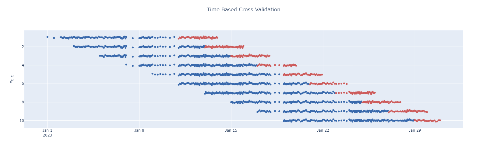

# Getting started

The following sections will guide you through the basic usage of the library.

## `TimeBasedSplit`

The [`TimeBasedSplit`](../api/timebasedcv.md#timebasedcv.core.TimeBasedSplit) class allows to define a way to split your data based on time. There is a (long) list of parameters that can be set to define how to generate the splits. These allow for a lot of flexibility in how the data is split. Here is an overview of them:

- `frequency`: we do not try to infer the frequency from the data, this information has to be specified beforehand. Available values are "days", "seconds", "microseconds", "milliseconds", "minutes", "hours", "weeks".
- `train_size`: defines the minimum number of time units required to be in the train set, e.g. if `frequency="days"` and `train_size=30`, the train set will have at least 30 days.
- `forecast_horizon`: specifies the number of time units to forecast, e.g. if `frequency="days"` and `forecast_horizon=7`, the forecast set will have 7 days. Notice that at the end of the time series, the forecast set might be smaller than the specified `forecast_horizon`.
- `gap`: the number of time units to skip between the end of the train set and the start of the forecast set.
- `stride`: how many time unit to move forward after each split. If `None`, the stride is equal to the `forecast_horizon`.
- `window`: it can be either "rolling" or "expanding"
- `mode`: it can be either "forward" or "backward" (generating splits either starting from the beginning or the end of the time series).

Well that is a lot of parameters! But in our opinion it is what makes the library so flexible and powerful to be able to cover the large majority of use cases!

!!! info
    As the list of so long, and it could be easy to provide values in the wrong order and/or be very hard to understand what each number means, we require to pass them as keyword only arguments!

```python title="Create a TimeBasedSplit instance"
from timebasedcv import TimeBasedSplit

tbs = TimeBasedSplit(
    frequency="days",
    train_size=10,
    forecast_horizon=5,
    gap=1,
    stride=3
)
```

Once an instance is created, it is possible to split a list of arrays using the `.split(...)` method, such method requires to pass a `time_series` as input to know how to split each array.

Optionally it is possible to pass a `start_dt` and `end_dt` arguments as well. If provided, they are used in place of the `time_series.min()` and `time_series.max()` respectively to determine the period.

This is useful because the series does not necessarely starts from the first date and/or terminates in the last date of the time period of interest, and it could lead to skewed splits.

!!! info
    We made the opinionated choice of returning the sliced arrays from `.split(...)`, while scikit-learn CV Splitters return train and test indices of the split.

```python title="Generate the data"
import numpy as np
import pandas as pd

RNG = np.random.default_rng(seed=42)

dates = pd.Series(pd.date_range("2023-01-01", "2023-01-31", freq="D"))
size = len(dates)

df = (pd.concat([
        pd.DataFrame({
            "time": pd.date_range(start, end, periods=_size, inclusive="left"),
            "a": RNG.normal(size=_size-1),
            "b": RNG.normal(size=_size-1),
        })
        for start, end, _size in zip(dates[:-1], dates[1:], RNG.integers(2, 24, size-1))
    ])
    .reset_index(drop=True)
    .assign(y=lambda t: t[["a", "b"]].sum(axis=1) + RNG.normal(size=t.shape[0])/25)
)

df.set_index("time").resample("D").agg(count=("y", np.size)).head(5)
```

```terminal
            count
time
2023-01-01      2
2023-01-02     18
2023-01-03     15
2023-01-04     10
2023-01-05     10
```

Now let's run split the data with the provided `TimeBasedSplit` instance:

```py title="Generate the splits"
X, y, time_series = df.loc[:, ["a", "b"]], df["y"], df["time"]

for X_train, X_forecast, y_train, y_forecast in tbs.split(X, y, time_series=time_series):
    print(f"Train: {X_train.shape}, Forecast: {X_forecast.shape}")
```

```terminal
Train: (100, 2), Forecast: (51, 2)
Train: (114, 2), Forecast: (50, 2)
...
Train: (124, 2), Forecast: (40, 2)
Train: (137, 2), Forecast: (22, 2)
```

As we can see, each split does not necessarely have the same number of points, this is because the time series has a different number of points per day.

Let's visualize the splits (blue dots represent the train points, while the red dots represent the forecastng points).



??? example "Code to generate the plot"

    ```python
    import plotly.graph_objects as go

    fig = go.Figure()

    for _fold, (train_forecast, split_state) in enumerate(
        tbs.split(y/25, time_series=time_series, return_splitstate=True),
        start=1,
        ):

        train, forecast = train_forecast

        ts = split_state.train_start
        te = split_state.train_end
        fs = split_state.forecast_start
        fe = split_state.forecast_end

        fig.add_trace(
            go.Scatter(
                x=time_series[time_series.between(ts, te, inclusive="left")],
                y=train + _fold,
                name=f"Train Fold {_fold}",
                mode="markers",
                marker={"color": "rgb(57, 105, 172)"}
            )
        )

        fig.add_trace(
            go.Scatter(
                x=time_series[time_series.between(fs, fe, inclusive="left")],
                y=forecast + _fold,
                name=f"Forecast Fold {_fold}",
                mode="markers",
                marker={"color": "indianred"}
            )
        )

        fig.update_layout(
            title={
                "text": "Time Based Cross Validation",
                "y":0.95, "x":0.5,
                "xanchor": "center",
                "yanchor": "top"
            },
            showlegend=True,
            height=500,
            yaxis = {"autorange": "reversed", "title": "Fold"}
        )

    fig.show()
    ```
